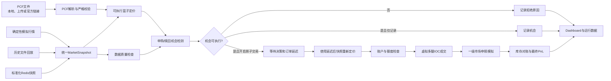
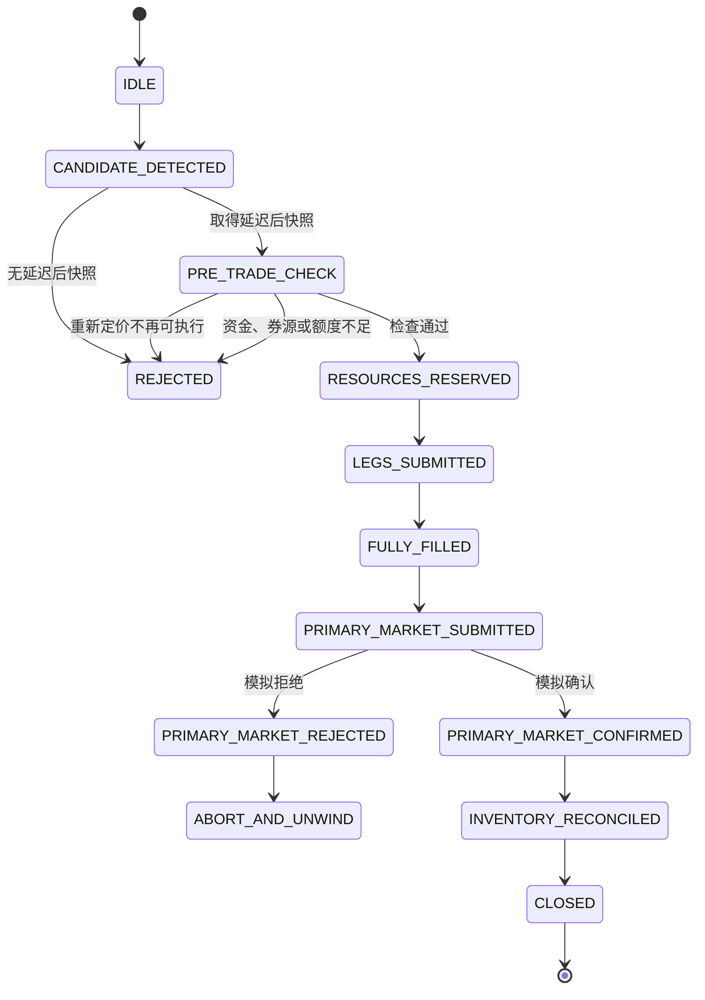

# 深市ETF实盘套利模拟系统详细设计报告

## 0. 文档信息

| 项目 | 内容 |
|---|---|
| 项目名称 | ETF Arbitrage v1.0 |
| 子系统 | 深市ETF可执行申赎套利模拟系统 |
| 文档类型 | 详细设计报告 |
| 文档版本 | 1.0 |
| 基准日期 | 2026-07-23 |
| 代码基线 | `main` / `500f830` |
| 当前状态 | 研究原型、纸面交易（Paper Trading） |
| 默认标的 | `159915` |
| 支持标的 | `159915`、`159901`、`159949`、`159903` |

> **安全边界：** 当前系统没有券商柜台、真实报单、撤单或基金公司申赎接口。所有订单均为内存中的模拟订单，并带有 `simulated_only=true` 标记。“实盘套利模拟”表示使用实盘逻辑做纸面推演，不表示系统能够真实交易。

---

## 1. 建设背景与目标

项目原有模块主要研究 ETF 二级市场价格相对 IOPV 的折溢价及其均值回复过程。该模型适合回答：

- 折溢价是否出现统计异常；
- 偏离持续多久；
- 偏离是否以及多快回归；
- 在指示性价格口径下，价差收敛指数如何变化。

但是，统计折溢价不等于可执行申赎套利。真实套利至少还需要同时满足：

1. ETF 和全部必需成分证券具有可成交的双边盘口；
2. 按最小申赎单位计算后，多档盘口深度足够；
3. PCF 的现金替代、预估现金差额、申赎开关和限额有效；
4. 交易成本、滑点、安全缓冲和申赎成本扣除后仍有正收益；
5. 从发现机会到下单时，延迟后的盘口仍然允许成交；
6. 账户资金、ETF 券源、成分股券源和当日额度满足要求；
7. 一级市场申购或赎回能够确认，最终现金差额不会吞噬利润。

本子系统的目标，是在不连接真实交易柜台的前提下，把上述约束组成一条可检查、可回放、可解释、可导出的模拟执行链路。

### 1.1 核心研究问题

- 一个表面上的折溢价，扣除真实买卖方向和盘口深度后是否仍然存在？
- 一次申购或赎回套利最多能执行多少个 CU？
- 延迟后重新定价会淘汰多少机会？
- 哪些机会被数据质量、流动性、PCF、成本或账户资源过滤？
- 申赎最终现金差额对单次循环和累计损益有多大影响？
- 模拟系统与未来实盘行情、券商接口之间需要补齐哪些能力？

### 1.2 非目标

当前版本不负责：

- 发送真实委托；
- 管理真实资金账户和证券账户；
- 保证 ETF 申赎资格、额度或券源可用；
- 精确复现交易所撮合队列；
- 处理真实部分成交后的动态撤单与对冲；
- 代替基金管理人、交易所或券商的正式 IOPV 和清算数据；
- 将均值回复回测收益解释为申赎套利收益。

---

## 2. 系统边界与页面隔离

项目保留两个相互独立的研究页面：

| 页面 | 主要用途 | 收益含义 |
|---|---|---|
| 实盘均值回复监控 | 折溢价监控、历史分布和价差收敛研究 | Premium 头寸的统计性收敛收益 |
| 实盘套利模拟 | 全篮子可执行定价、纸面下单、模拟申赎和结算 | 申赎套利循环的模拟执行损益 |

页面入口由 `streamlit_app.py` 统一导航，但两套页面使用不同的业务模块与会话状态。可执行套利内容不会进入均值回复页面。

---

## 3. 总体架构



### 3.1 设计原则

1. **行情源解耦：** 所有行情源实现统一 `MarketDataSource` 接口。
2. **数据模型统一：** 下游只接收 `MarketSnapshot`，不感知 Redis、CSV 或模拟器字段。
3. **方向定价分离：** 申购使用成分股卖盘和 ETF 买盘；赎回使用 ETF 卖盘和成分股买盘。
4. **先校验再执行：** 数据质量和 PCF 问题通过明确原因拒绝，不静默忽略。
5. **决策与成交分离：** 发现机会后，必须在延迟后的快照上重新检查。
6. **结果可复核：** 快照、机会、拒绝、订单、成交、申赎、质量事件和损益均可导出。
7. **默认不交易：** 自动影子交易默认关闭；即使开启，也只能生成模拟订单。

---

## 4. 模块划分

| 模块 | 主要文件 | 职责 |
|---|---|---|
| 配置 | `src/etf_arbitrage/executable_config.py` | 数据源、模拟、成本、执行、质量、账户和一级市场参数 |
| PCF | `data/pcf.py`、`data/pcf_validation.py`、`data/pcf_repository.py` | XML 解析、字段建模、哈希与业务校验、文件存储 |
| 行情抽象 | `market_data/source.py`、`market_data/models.py` | 行情源接口、盘口和快照数据结构 |
| 模拟行情 | `market_data/simulated.py` | 根据真实 PCF 生成可复现的 ETF 与成分股多档盘口 |
| 文件回放 | `market_data/file_replay.py` | CSV、JSON、JSONL、Parquet 标准化和无未来数据回放 |
| Redis | `market_data/redis_source.py` | 读取标准化 Redis JSON 快照，默认关闭 |
| 数据质量 | `market_data/quality.py` | 时效、完整性、盘口合法性、停牌涨跌停和 IOPV 偏差检查 |
| 深度扫单 | `pricing/depth_sweep.py` | 按交易方向逐档计算成交量、均价、金额和未成交量 |
| 篮子定价 | `pricing/basket.py` | 申购成本、赎回收入、现金替代和内部 IOPV |
| 机会检测 | `arbitrage/detector.py` | 净利润、上下界、方向过滤、PCF 限额和容量 |
| 纸面成交 | `execution/simulator.py` | 将完整深度结果转换为虚拟 IOC 订单和成交 |
| 一级市场 | `primary_market/emulator.py` | 模拟申赎接收、确认、拒绝和最终现金差额 |
| 账户 | `portfolio/account.py` | 资金、券源、当日 CU、已实现损益和流水 |
| 编排引擎 | `engine/paper_arbitrage_engine.py` | 从机会发现到申赎结算的状态机 |
| 记录 | `reporting/persistence.py` | CSV、Parquet、JSON 配置和运行摘要 |
| Dashboard | `dashboard/executable_app.py` | 参数控制、连续回放、图表、日志和导出 |

---

## 5. 核心数据模型

### 5.1 盘口档位 `OrderBookLevel`

| 字段 | 含义 |
|---|---|
| `price` | 档位价格，必须大于 0 |
| `quantity` | 档位可见数量，不能为负 |

### 5.2 证券盘口 `OrderBook`

| 字段 | 含义 |
|---|---|
| `symbol` | 证券代码 |
| `exchange` | 交易所，当前为 `SZSE` |
| `exchange_timestamp` | 交易所行情时间 |
| `receive_timestamp` | 系统接收时间 |
| `last_price` | 最新成交价，仅作展示和折溢价参考 |
| `last_quantity` | 最新成交量 |
| `bids` / `asks` | 最多可载入 10 档的买卖盘口 |
| `trading_status` | 正常、停牌、涨停、跌停、临停或未知 |
| `upper_limit_price` / `lower_limit_price` | 涨跌停价 |
| `sequence_number` | 行情序号 |
| `source` | 行情来源 |

当且仅当买一和卖一都存在、价格为正且 `best_bid <= best_ask` 时，盘口被视为有效双边盘口。

### 5.3 市场快照 `MarketSnapshot`

一个快照包含：

- 快照时间；
- ETF 完整盘口；
- 全部已取得的成分证券盘口；
- 官方 IOPV；
- 行情源提供的内部 IOPV；
- 数据质量状态；
- 数据源模式；
- 序号断档标记；
- 解码错误信息。

套利引擎会根据当前成分股盘口重新计算内部 IOPV，不直接信任行情源附带的内部 IOPV。

### 5.4 PCF 数据

PCF 头部主要字段包括：

- ETF 代码、名称和跟踪指数；
- 交易日和上一交易日；
- 最小申赎单位 `CreationRedemptionUnit`；
- 预估现金差额 `EstimateCashComponent`；
- 前一日现金差额、单位净值和每 CU 净值；
- 申购、赎回开关；
- 申购、赎回及净申赎限额；
- 最大现金替代比例；
- 成分记录数。

每只成分证券包括：

- 证券代码和名称；
- 每 CU 数量；
- 现金替代标志；
- 申购现金替代金额；
- 赎回现金替代金额；
- 申购溢价比例；
- 赎回折价比例。

现金替代标志：

| 值 | 名称 | 当前处理 |
|---|---|---|
| `0` | 禁止现金替代 | 必须使用实物盘口 |
| `1` | 允许现金替代 | 默认仍使用实物；可通过高级参数改为现金 |
| `2` | 必须现金替代 | 使用 PCF 中方向对应的现金替代金额 |

---

## 6. PCF 载入与校验

### 6.1 支持方式

1. 按项目目录查找本地 PCF；
2. 在页面上传 XML 或包含唯一目标 XML 的 ZIP；
3. 输入深交所下载页或报告文件直链；
4. 使用配置文件或环境变量保存各 ETF 的 URL 模板。

PCF 标准存储路径：

```text
data/pcf/YYYYMMDD/pcf_ETFCODE_YYYYMMDD.xml
```

### 6.2 原子保存

下载或上传的数据先写入 `.xml.tmp`，完成解析和业务校验后再替换正式文件。校验失败会删除临时文件，避免无效网页、错误日期或错误标的被后续流程误用。

### 6.3 校验项目

- XML 能否解析；
- 命名空间是否支持；
- 必填字段是否存在；
- 数字、整数和日期格式是否合法；
- PCF ETF 代码是否等于所选标的；
- PCF 交易日是否等于所选交易日；
- 最小申赎单位是否为正；
- `RecordNum`、`TotalRecordNum` 与实际成分数是否一致；
- 是否存在重复成分证券；
- 现金差额是否为有效数字；
- 文件大小、修改时间和 SHA256 哈希；
- 申购、赎回关闭等警告；
- 必须现金替代但现金金额为零的警告。

只有通过代码和交易日校验的 PCF 才能启动可执行模拟。

---

## 7. 模拟行情详细设计

### 7.1 基本目的

`SimulatedMarketDataSource` 不试图预测真实行情。它用真实 PCF 的成分数量、申赎单位和现金字段，构造内部一致的多证券、多档盘口，用于验证：

- 定价方向是否正确；
- 深度不足是否会被拒绝；
- 数据质量门禁是否生效；
- 延迟后重新定价是否生效；
- 纸面交易状态机能否完整闭环。

### 7.2 时间轴

- 起点固定为 PCF 交易日 `09:30:00`，时区为 `Asia/Shanghai`；
- 第 `k` 个快照时间为：

```text
T(k) = 09:30:00 + k * tick_interval_ms
```

- 默认 Tick 间隔为 1,000 毫秒；
- 默认总长度为 300 个 Tick；
- 到达总长度后抛出结束信号并停止；
- 当前时间轴连续推进，尚未模拟午间休市、集合竞价和收盘边界。

### 7.3 成分股初始价格

对需要实物交付的有效成分股，先使用固定随机种子生成 `8` 至 `80` 之间的原始价格，再统一缩放，使实物篮子价值接近：

```text
目标实物篮子价值
= PCF每CU净值
- 预估现金差额
- 必须现金替代的申购现金金额
```

该处理保证模拟价格与 PCF 的资产规模大体一致，而不是生成一组与申赎单位无关的随机价格。

### 7.4 成分股价格演化

每个 Tick、每只成分股独立执行：

```text
P(i,t) = max(0.01, P(i,t-1) * (1 + epsilon(i,t)))
epsilon(i,t) ~ Normal(0, base_volatility)
```

默认 `base_volatility=0.00015`。当前模型没有相关性矩阵、行业因子、指数共同因子、日内波动率曲线或价格跳跃。

### 7.5 内部 IOPV

模拟器生成行情时使用：

```text
InternalIOPV
= (
    sum(实物成分数量 * 成分股模拟价格)
    + 必须现金替代申购金额
    + PCF预估现金差额
  )
  / 最小申赎单位
```

正式机会检测时，篮子定价器会使用成分股买一卖一中间价再次计算内部 IOPV。

### 7.6 官方 IOPV

模拟官方 IOPV 为：

```text
OfficialIOPV = InternalIOPV * (1 + eta)
eta ~ Normal(0, 0.00002)
```

即默认加入标准差约 `0.2 bp` 的独立误差，用于测试内部估值与官方 IOPV 的偏差监控。

### 7.7 ETF 中间价与折溢价

```text
ETF_Mid = InternalIOPV * (1 + PremiumBps / 10000)
```

正常场景下，`PremiumBps ~ Normal(0, 0.5)`。

冲击场景：

```text
溢价冲击：PremiumBps = +ShockBps
折价冲击：PremiumBps = -ShockBps
均值回复：PremiumBps = ShockBps * exp(-speed * elapsed_tick)
```

冲击只在设置的开始 Tick 与持续 Tick 区间内生效，区间外回到 0。

### 7.8 多档盘口

ETF 和成分股盘口都围绕中间价对称生成。半价差为：

```text
HalfSpread = max(0.0005, Mid * SpreadBps / 20000)
```

第 `L` 档距离和数量：

```text
Distance(L) = HalfSpread * (1 + L)
Quantity(L) = BaseDepth * DepthDecay^L
```

其中 `L` 从 0 开始。

默认设置：

| 参数 | ETF | 成分股 |
|---|---:|---:|
| 价差 | 2 bp | 4 bp |
| 档位 | 5 | 5 |
| 第一档深度 | `2 * CU` | `2 * max(成分数量, 100)` |
| 深度衰减 | 0.85 | 0.85 |

模拟最新价等于中间价，最新成交量固定为 100；涨跌停价暂按中间价上下 20% 生成。

### 7.9 场景矩阵

| 中文场景 | 枚举 | 注入方式 | 预期影响 |
|---|---|---|---|
| 正常行情 | `NORMAL` | 小幅随机折溢价 | 通常被成本门槛过滤 |
| ETF溢价冲击 | `PREMIUM_SHOCK` | 固定正溢价 | 主要测试申购套利 |
| ETF折价冲击 | `DISCOUNT_SHOCK` | 固定负溢价 | 主要测试赎回套利 |
| 折溢价均值回复 | `MEAN_REVERSION` | 指数衰减正溢价 | 测试机会随时间消失 |
| ETF盘口深度不足 | `ETF_DEPTH_SHORTAGE` | ETF首档基础深度降至 `0.05 CU` | ETF腿无法完整成交 |
| 成分股盘口深度不足 | `COMPONENT_DEPTH_SHORTAGE` | 第一只成分股深度降至需求量的约 5% | 篮子腿无法完整成交 |
| 成分股报价陈旧 | `STALE_QUOTE` | 部分成分股时间回退 20 秒 | 超过年龄阈值后禁止新交易 |
| 成分股行情缺失 | `MISSING_QUOTE` | 删除前若干只成分股 | IOPV和篮子不完整 |
| 成分股停牌 | `SUSPENSION` | 部分成分股状态改为停牌 | 停牌代理权重超限后禁止交易 |
| 涨停且无卖盘 | `LIMIT_UP_NO_ASK` | 状态为涨停并移除卖盘 | 申购买入篮子受阻 |
| 跌停且无买盘 | `LIMIT_DOWN_NO_BID` | 状态为跌停并移除买盘 | 赎回卖出篮子受阻 |
| 行情解码错误 | `DECODE_ERROR` | 写入解码错误字段 | 触发严重错误和熔断 |
| 行情序号断档 | `SEQUENCE_GAP` | 序号步长改为 2 并设置断档标记 | 触发严重错误和熔断 |
| 异常交叉盘口 | `CROSSED_BOOK` | ETF买一高于卖一 | 触发严重错误和熔断 |
| PCF交易日无效 | `PCF_INVALID` | 快照日期加一天 | 触发 PCF 日期不匹配 |

### 7.10 加速播放

加速只改变模拟时间相对墙上时间的播放速度，不改变每个 Tick 的金融计算。

```text
单Tick等待时间 = Tick间隔 / 播放倍速
```

为了减少 Streamlit 全页刷新造成的闪烁，系统将最短刷新间隔设为 0.25 秒。当倍速较高时，一次页面刷新会批量推进多个 Tick：

```text
每次刷新步数 = ceil(0.25 / 单Tick等待时间)
```

例如，Tick 间隔 1 秒、速度 100 倍时，每约 0.25 秒刷新一次，每次推进约 25 个 Tick。

---

## 8. 历史文件与 Redis 行情

### 8.1 统一行情源接口

所有数据源实现：

- `connect()` / `disconnect()`；
- `start()` / `stop()`；
- `subscribe(symbols)`；
- `get_latest_snapshot()`；
- `step()`；
- `snapshot_at_or_after(timestamp)`；
- `health()`。

因此，定价和执行引擎不需要知道行情来自模拟、文件还是 Redis。

### 8.2 文件回放

支持格式：

- CSV；
- JSON；
- JSONL；
- Parquet。

最低必需列：

| 列 | 含义 |
|---|---|
| `timestamp` | 快照时间 |
| `symbol` | 证券代码 |
| `is_etf` | 是否为 ETF |

可选盘口列采用：

```text
bid1_price ... bid10_price
bid1_quantity ... bid10_quantity
ask1_price ... ask10_price
ask1_quantity ... ask10_quantity
```

另外可载入最新价、状态、涨跌停价、行情序号、官方 IOPV、内部 IOPV、序号断档和解码错误等字段。供应商字段通过 `schema_mapping` 在载入层改名，不进入业务引擎。

回放按时间排序，并提供：

- 决策时点之前或等于该时点的最后快照；
- 指定延迟时间之后或等于该时点的第一份快照；
- 跳转到指定时间；
- 到达文件末尾后停止。

### 8.3 Redis

当前 Redis 适配器读取一个**已经标准化的完整快照**：

```text
Key = {key_prefix}:snapshot:{etf_code}
默认示例 = etf_arbitrage:snapshot:159915
```

Value 必须是：

- 行记录数组；或
- 包含 `rows` 数组的 JSON 对象。

每一行使用与文件回放相同的标准字段。适配器使用 RESP2，按需导入 `redis` 包，默认 `enabled=false`。

当前限制：

- 尚未直接读取早期 `sz_quotation.py` 的日期 Hash 和 `159915.SZ` 原始字段；
- 尚未把仅含最新成交价的旧 JSONL 自动转换成完整可执行盘口；
- `channel_pattern` 已保留在配置中，但当前实现仍按 Key 拉取，不使用 Pub/Sub；
- Redis 中如果没有 ETF 与成分股双边盘口，系统只能做均值回复观察，不能完成可执行申赎定价。

---

## 9. 可执行定价算法

### 9.1 深度扫单

买入时使用卖盘并按价格从低到高成交；卖出时使用买盘并按价格从高到低成交。

每档有效数量先乘深度折减：

```text
EffectiveQuantity = DisplayedQuantity * DepthHaircut
```

默认 `DepthHaircut=0.90`，即只相信可见深度的 90%。

执行情景对每个档位施加不利滑点：

| 情景 | 滑点 |
|---|---:|
| `OPTIMISTIC` | 0 bp |
| `BASE` | 0.5 bp |
| `STRESS` | 2 bp |

买入成交价上调，卖出成交价下调。输出包括请求量、成交量、未成交量、平均价、最差价、成交金额、消耗档位数和是否完整成交。

任一必要腿深度不足时，整次机会被拒绝。当前执行策略为虚拟全成或全撤，不创建部分成交订单。

### 9.2 内部 IOPV

正式定价器使用成分股盘口中间价：

```text
InternalIOPV
= (
    sum(实物成分数量 * 成分股Mid)
    + 必须现金替代金额
    + 预估现金差额
  )
  / CU份额数
```

任一必需实物成分缺少有效中间价时，内部 IOPV 为无效值；数据质量和篮子深度检查会进一步给出拒绝原因。

### 9.3 申购套利

经济动作：

1. 买入每 CU 所需成分股；
2. 支付现金替代和预估现金差额；
3. 卖出相同份额的 ETF；
4. 模拟提交申购，用篮子换回 ETF；
5. 用新申购 ETF 对冲或归还先前卖出的 ETF。

核心公式：

```text
CreationGrossProfit
= ETF按买盘卖出所得
- 成分篮子按卖盘买入成本
- 现金替代
- 预估现金差额
```

申购方向必须同时具备：

- 成分股完整卖盘深度；
- ETF 完整买盘深度；
- PCF 允许申购；
- 申购限额未超；
- 方向未被禁用；
- 数据质量通过；
- 成本和缓冲后利润达到门槛。

### 9.4 赎回套利

经济动作：

1. 按 ETF 卖盘买入足够份额；
2. 模拟提交赎回，换回成分股和现金；
3. 按成分股买盘卖出篮子；
4. 收取现金替代和最终现金差额。

核心公式：

```text
RedemptionGrossProfit
= 成分篮子按买盘卖出所得
+ 现金替代
+ 预估现金差额
- ETF按卖盘买入成本
```

赎回方向必须同时具备：

- ETF 完整卖盘深度；
- 成分股完整买盘深度；
- PCF 允许赎回；
- 赎回限额未超；
- 方向未被禁用；
- 数据质量通过；
- 成本和缓冲后利润达到门槛。

### 9.5 成本与安全缓冲

通用二级市场成本：

```text
SecondaryCost
= (实物篮子成交额 + ETF成交额)
* SecondaryMarketBps / 10000
```

一级市场费用：

```text
PrimaryFee = 方向篮子参考价值 * CreationOrRedemptionFeeBps / 10000
```

执行模式附加成本：

- `INVENTORY_LOCKED`：加入借券成本；
- `SEQUENTIAL_NO_BORROW`：加入资金成本。

安全缓冲：

```text
SafetyBuffer = 篮子参考价值 * SafetyBufferBps / 10000
```

机会净利润：

```text
SignalNetProfit = GrossProfit - EstimatedCosts - SafetyBuffer
```

安全缓冲用于是否发出信号，不在最终结算中再次作为真实损失扣除。

### 9.6 利润门槛

机会必须同时满足：

- `SignalNetProfit > 0`；
- `SignalNetProfit >= MinimumProfitAmount`；
- `SignalNetProfitBps >= MinimumProfitBps`。

默认最低利润金额为 100 元，最低利润率为 1 bp，安全缓冲为 3 bp。

### 9.7 无套利上下界

```text
UpperBound
= (
    申购篮子总成本
    + 估算成本
    + 安全缓冲
  )
  / ETF份额数
```

当 ETF 可卖价格显著高于上界时，可能存在申购套利。

```text
LowerBound
= (
    赎回篮子总收入
    - 估算成本
    - 安全缓冲
  )
  / ETF份额数
```

当 ETF 可买价格显著低于下界时，可能存在赎回套利。

上下界是按当前多档盘口和设置参数计算的动态边界，不是固定折溢价阈值。

### 9.8 容量

系统从 1 CU 开始递增测试，直到：

- 达到单笔最大 CU；
- 达到当日最大 CU 配置；
- PCF 限额触发；
- ETF 深度不足；
- 某只成分股深度不足；
- 利润门槛不满足。

输出：

- 最大可执行 CU；
- 瓶颈证券；
- 瓶颈方向；
- 未满足数量；
- 每增加一个 CU 的边际利润。

---

## 10. 数据质量、交易许可与熔断

### 10.1 三层状态

| 状态 | 含义 |
|---|---|
| `GOOD` | 未发现阻断项 |
| `DEGRADED` | 发现普通阻断项，禁止新交易 |
| `INVALID` | 发现严重数据错误 |

### 10.2 严重错误

严重错误包括：

- PCF 与快照交易日不一致；
- 行情解码错误；
- 行情序号断档；
- 非法价格或数量；
- 买一价高于卖一价的交叉盘口。

严重错误会进入阻断原因，并在启用熔断时令 `kill_switch=true`。

### 10.3 普通阻断项

- ETF 行情年龄超限；
- ETF 缺少有效双边盘口；
- 成分股行情缺失代理权重超限；
- 成分股行情陈旧代理权重超限；
- ETF 与成分股横截面时差超限；
- 停牌代理权重超限；
- 涨停无卖盘代理权重超限；
- 跌停无买盘代理权重超限；
- 内部 IOPV 与官方 IOPV 偏差超限。

官方 IOPV 缺失目前只产生警告，不单独禁止交易；但内部篮子和盘口仍必须完整。

### 10.4 默认阈值

| 指标 | 默认值 |
|---|---:|
| 最大报价年龄 | 5,000 ms |
| 最大横截面时差 | 5,000 ms |
| 最大缺失代理权重 | 1% |
| 最大陈旧代理权重 | 5% |
| 最大停牌代理权重 | 5% |
| 最大涨停无卖盘代理权重 | 10% |
| 最大跌停无买盘代理权重 | 10% |
| 最大 IOPV 误差 | 30 bp |

### 10.5 “新交易许可”和“风控熔断”的区别

- **新交易许可：** 只要存在任一严重错误或普通阻断项，就显示“禁止”。
- **风控熔断：** 仅在严重错误存在且启用了熔断开关时显示“已触发”。

因此，关闭“启用风控熔断”只会关闭严重错误的熔断标志，不会绕过质量阻断；数据无效时，新交易仍然禁止。

---

## 11. 纸面交易执行流程

### 11.1 默认行为

默认：

- `auto_paper_trade=false`；
- `record_opportunities_only=true`。

系统只计算和记录机会，不创建订单。

只有主动打开“自动影子交易”，并关闭“只记录机会”，系统才进入纸面执行流程。

### 11.2 决策到成交



执行步骤：

1. 在决策快照上计算申购和赎回；
2. 选择所有可执行方向中净利润更高者；
3. 计算 `决策延迟 + 订单延迟`；
4. 取得不早于目标时间的第一份快照；
5. 在延迟后快照上重新计算全篮子和 ETF 深度；
6. 检查资金、券源和当日 CU；
7. 生成成分股和 ETF 的虚拟 `MARKETABLE_IOC` 订单；
8. 按已经计算的多档深度生成虚拟成交；
9. 提交模拟一级市场申购或赎回；
10. 根据最终现金差额结算账户和损益。

### 11.3 虚拟成交原则

- 订单类型固定为 `MARKETABLE_IOC`；
- 成交策略固定为 `VIRTUAL_ALL_OR_NONE`；
- 只有所有必需腿均可完整成交时才创建订单；
- 每个订单和成交都有独立 ID，并归属于一个 `cycle_id`；
- 当前没有真实排队位置、撤单延迟、盘口抢占或成交概率模型。

### 11.4 执行模式

#### `INVENTORY_LOCKED`

使用已有库存或虚拟券源近似两边同时锁价：

- 申购套利检查 ETF 库存及 ETF 虚拟券源上限；
- 赎回套利检查是否允许成分股虚拟借券；
- 成本模型使用借券成本；
- 风险标签为近似锁定套利。

#### `SEQUENTIAL_NO_BORROW`

不使用虚拟借券，成本模型使用资金成本，并标记存在市场暴露。当前版本仍按同一延迟后快照生成两边虚拟成交，因此它只是风险标签和成本口径的第一版近似，尚未模拟“先申赎、后卖出”期间的完整价格路径。

---

## 12. 一级市场与最终损益

### 12.1 一级市场模拟

可配置：

- 申赎确认延迟；
- 申赎拒绝概率；
- 最终现金差额误差；
- 最终退补款延迟；
- 随机种子。

成功状态序列：

```text
REQUEST_CREATED
-> REQUEST_SUBMITTED
-> REQUEST_ACCEPTED
-> REQUEST_CONFIRMED
-> FINAL_CASH_SETTLED
```

拒绝状态：

```text
REQUEST_CREATED
-> REQUEST_SUBMITTED
-> REQUEST_REJECTED
```

### 12.2 最终现金差额

```text
FinalCashComponent
= EstimateCashComponent
+ CashComponentError
```

最终损益：

```text
ExecutionProfit = GrossProfit - EstimatedCosts
```

申购方向：

```text
FinalPnL
= ExecutionProfit
- (FinalCashComponent - EstimateCashComponent) * CUCount
```

赎回方向：

```text
FinalPnL
= ExecutionProfit
+ (FinalCashComponent - EstimateCashComponent) * CUCount
```

### 12.3 一级市场拒绝

当前一级市场拒绝后：

- 状态进入 `ABORT_AND_UNWIND`；
- 最终损益暂按负的估算交易成本处理；
- 尚未按拒绝后的实时盘口模拟真正反向平仓；
- 因此拒绝场景下的损失是保守占位或研究近似，不是完整的解套结果。

---

## 13. 账户与资源检查

默认账户：

| 参数 | 默认值 |
|---|---:|
| 初始虚拟现金 | 50,000,000 |
| 初始 ETF 库存 | 0 |
| ETF 虚拟券源上限 | 10,000,000 份 |
| 允许成分股虚拟借券 | 是 |
| 当日最大 CU | 10 |

### 13.1 申购方向

需要：

- 成分篮子总成本和估算成本所需现金；
- 若库存不足，在库存锁定模式下需要 ETF 虚拟券源；
- 所需借券量不能超过 ETF 券源上限。

### 13.2 赎回方向

需要：

- 买入 ETF 和估算成本所需现金；
- 在库存锁定模式下允许借入成分股。

### 13.3 结算

成功循环结算时：

- 虚拟现金加上最终 PnL；
- 累计已实现 PnL 增加；
- 当日已执行 CU 增加；
- 写入账户流水；
- 证券库存视为已经通过申赎完成对账。

当前账户没有逐腿冻结、逐证券库存余额、保证金、利息按时间计提和跨日重置。

---

## 14. Dashboard 设计

### 14.1 控制区

侧边栏分为：

1. 基础设置；
2. PCF；
3. 行情与回放；
4. 执行参数；
5. 账户与一级市场情景；
6. 数据质量阈值。

主控制按钮：

- 开始；
- 暂停；
- 单步；
- 恢复；
- 重置。

模拟模式显示当前 Tick、总 Tick、进度条、模拟速度和模拟时间。

### 14.2 页面页签

| 页签 | 内容 |
|---|---|
| 实时总览 | 系统状态、交易许可、熔断、ETF盘口、IOPV、上下界和方向净利润 |
| PCF | 头部字段、哈希、申赎开关、限额、现金替代统计和成分明细 |
| 盘口与篮子 | ETF 多档盘口、成分股买一卖一、篮子价值和瓶颈 |
| 套利机会 | 机会明细、拒绝原因、容量和 N0-N5 漏斗 |
| 订单与申赎 | 模拟订单、模拟成交和一级市场请求 |
| 损益 | 虚拟现金、已实现损益、当日 CU 和累计 PnL |
| 数据质量与日志 | 每个快照的质量指标和数据源健康状态 |
| 历史数据与导出 | 文件摘要、配置、数据表下载和完整运行保存 |

### 14.3 实时总览图表

1. **当前价格对比柱图：** Lower Bound、ETF Bid、Internal IOPV、ETF Ask、Upper Bound。
2. **分时折线图：** ETF 最新价、ETF 买一、ETF 卖一、官方 IOPV、内部 IOPV。
3. **日 K 线：** 按交易日将 ETF 最新价聚合为 OHLC，作为未来多日记录对比的预留视图。

分时图使用统一悬停信息和跨图内时间指示线。当前单日模拟只会在日 K 图形成一根 K 线。

### 14.4 机会漏斗

| 阶段 | 定义 |
|---|---|
| N0 快照 | 已处理决策快照数 |
| N1 成本前正边际 | 至少一个方向毛边际为正 |
| N2 深度完整 | ETF 与篮子所需盘口均完整 |
| N3 成本后可执行 | 所有质量、成本、限额和门槛通过 |
| N4 延迟后成交 | 延迟后仍通过并产生虚拟成交 |
| N5 最终盈利 | 最终现金差额结算后 PnL 大于 0 |

---

## 15. 运行记录与可追溯性

内存历史表：

| 表 | 内容 |
|---|---|
| `snapshots` | ETF价格、Bid/Ask、双 IOPV 和完整成分盘口 JSON |
| `opportunities` | 每个快照的申购和赎回评价 |
| `rejected_opportunities` | 不可执行机会及原因 |
| `orders` | 虚拟订单 |
| `fills` | 虚拟成交 |
| `primary_market_requests` | 模拟申赎请求 |
| `trades` | 完整交易循环和状态历史 |
| `pnl` | 快照利润、执行利润和最终损益 |
| `data_quality_events` | 每个快照的质量指标 |

完整运行保存到：

```text
data/runs/run-XXXXXXXXXXXX/
```

目录包含：

- `config.json`；
- 每张表的 UTF-8 BOM CSV；
- 环境存在 Parquet 引擎时的 Parquet 文件；
- `run_summary.json`。

运行摘要记录 ETF、PCF 路径、最终现金、已实现损益、运行 ID 和各表行数。

---

## 16. 默认配置基线

### 16.1 模拟行情

| 参数 | 默认值 |
|---|---:|
| 场景 | 正常行情 |
| 随机种子 | 42 |
| Tick 间隔 | 1,000 ms |
| 总 Tick | 300 |
| 播放速度 | 1x |
| 基础波动率 | 0.00015 |
| ETF 价差 | 2 bp |
| 成分股价差 | 4 bp |
| 档位 | 5 |
| 每档基础深度 | 2 |
| 深度衰减 | 0.85 |
| 折溢价冲击 | 35 bp |
| 行情接收延迟 | 50 ms |

### 16.2 执行

| 参数 | 默认值 |
|---|---:|
| 方向 | 双向 |
| 模式 | 库存锁定 |
| 情景 | BASE |
| 每次 CU | 1 |
| 单笔最大 CU | 1 |
| 当日最大 CU | 10 |
| 决策延迟 | 50 ms |
| 订单延迟 | 50 ms |
| 申赎确认延迟 | 500 ms |
| 深度折减 | 90% |
| 安全缓冲 | 3 bp |
| 最低利润率 | 1 bp |
| 最低利润金额 | 100 元 |
| 可选现金替代 | 关闭 |
| 自动影子交易 | 关闭 |
| 只记录机会 | 开启 |

### 16.3 成本

| 参数 | 默认值 |
|---|---:|
| 二级市场成本 | 3 bp |
| 申购费 | 0 bp |
| 赎回费 | 0 bp |
| 借券成本 | 0 bp |
| 资金成本 | 0 bp |

这些值只是研究基线。进入实盘准备前，必须按券商、账户类型、交易方向和真实持有时间校准。

---

## 17. 测试设计与当前证据

当前测试覆盖：

- 真实深市 PCF 样本解析；
- 紧凑 PCF 可选字段；
- PCF IOPV 与缺失价格；
- 多档买入、卖出和深度不足；
- 溢价对应申购、折价对应赎回；
- 成本与深度淘汰机会；
- PCF 日期、代码、限额和方向过滤；
- 陈旧、缺失、涨跌停、解码、序号和交叉盘口；
- 模拟行情可复现和有限时间轴；
- 文件回放不使用未来快照；
- Redis 默认关闭且不强制依赖；
- 延迟后无可用快照时拒绝；
- 申购和赎回端到端闭环；
- 高倍速批量推进；
- Tick 历史聚合为日 OHLC。

基准验证命令：

```powershell
python -m pytest -q
```

2026-07-23 使用项目内 Python 3.14 环境执行结果为：`57 passed`。

设计要求是：任何定价、质量门禁、现金替代、延迟或 PnL 公式的修改，都应补充对应单元测试或端到端测试。

---

## 18. 当前实现限制与风险

### 18.1 P0：接入真实纸面监控前必须解决

1. **Redis 字段尚未适配公司原始快照。** 当前需要标准化完整盘口 Key，不能直接消费早期 `.SZ` 日期 Hash。
2. **缺少真实全篮子盘口验证。** 只有 ETF 最新价或单边价格无法计算可执行申赎套利。
3. **申赎权限与额度是 PCF 静态检查。** 尚未接入券商或基金公司的账户级实时权限。
4. **券源是配置值。** 没有真实 ETF 或成分股券源、费率和可借期限。
5. **成本未按真实规则拆分。** 印花税、佣金、经手费、过户费、融资融券费率和资金占用需逐项建模。

### 18.2 P1：提高模拟真实性

1. 数据质量中的缺失、陈旧、停牌和涨跌停比例，当前按 `component_share / sum(component_share)` 计算，是数量份额代理，不是实时市值权重。
2. 模拟停牌和涨跌停对象按成分列表前若干只选择，不按目标市值权重精确抽样。
3. 随机 `sequence_gap_probability` 会改变序号步长，但当前只有显式 `SEQUENCE_GAP` 场景写入断档标记；外部连续序号检测仍需增加。
4. 外部快照的 `data_quality_status` 字段没有被质量检查器直接作为阻断依据，主要依赖具体错误字段。
5. 自动影子交易取得延迟后快照时会推进数据源；这些作为成交依据的快照目前不单独写入快照历史，图表可能跳过中间 Tick。
6. 一级市场模拟为同步返回结果，只在时间字段上体现确认和退补款延迟，没有真正的异步待处理队列。
7. 一级市场拒绝后的 `ABORT_AND_UNWIND` 尚未根据拒绝时盘口逐腿反向平仓。
8. `SEQUENTIAL_NO_BORROW` 尚未模拟申赎等待期间的真实价格路径。
9. 账户只在循环结束时增加最终 PnL，没有逐腿现金冻结、库存变化和保证金。
10. 容量展示尚未扣除账户当天已经使用的 CU，只在真正执行资源检查时限制累计 CU。

### 18.3 P2：扩展研究能力

1. 模拟价格缺少股票相关性、指数共同因子和日内波动率形态。
2. 时间轴没有集合竞价、午休、收盘和跨交易日交易日历。
3. 日 K 线只由运行内历史聚合，尚未自动合并多日持久化记录。
4. 没有盘口队列、撤单、成交概率、冲击成本和竞争者抢单模型。
5. 没有多 ETF 组合级资金、券源和风险预算。
6. 没有沪市、跨市场、港股通和 QDII 的交易时段、汇率和结算规则。

---

## 19. 后续实施路线

### 阶段 A：公司 Redis 标准化接入

1. 保存原始 Redis 消息样本和字段说明；
2. 建立“供应商字段 -> 标准 `MarketSnapshot`”适配器；
3. 统一证券代码为内部代码，并在 Redis 边界处理 `.SZ`；
4. 校验 ETF 与全部 PCF 成分证券的 Bid/Ask、档位、时间和序号；
5. 将原始消息与标准化快照同时落盘；
6. 增加断线重连、心跳、重复消息和序号连续性监控。

### 阶段 B：真实行情影子运行

1. 每日盘前人工放置并校验 PCF；
2. 开盘期间只记录快照和机会，不创建纸面订单；
3. 收盘后回放同一批快照；
4. 比较官方 IOPV、内部 IOPV 和最终现金差额；
5. 统计 N0-N5 漏斗及主要拒绝原因；
6. 校准成本、深度折减、安全缓冲和延迟。

### 阶段 C：纸面执行增强

1. 将一级市场请求改为异步事件；
2. 实现逐腿部分成交、撤单和反向平仓；
3. 建立逐证券现金与库存账本；
4. 加入真实券源快照和借券成本期限结构；
5. 增加故障恢复、运行检查点和跨进程状态持久化。

### 阶段 D：实盘准备评审

在考虑任何真实交易接口之前，至少完成：

- 行情完整性与时延审计；
- PCF 和最终现金差额误差统计；
- 连续不少于一个月的影子运行；
- 成本与滑点压力测试；
- 风险限额和人工复核流程；
- 柜台沙箱测试；
- 紧急撤单、断线和熔断演练；
- 合规、运营、清算和基金申赎资格确认。

---

## 20. 验收标准

当前原型满足以下标准时，可认为“可执行套利模拟”功能完整：

1. 能载入并严格校验指定日期、指定 ETF 的真实 PCF；
2. 能在统一模型中接收 ETF 与成分股多档盘口；
3. 能分别计算申购和赎回的全篮子可执行价格；
4. 能逐档计算成交均价和深度瓶颈；
5. 能扣除成本、安全缓冲并输出动态上下界；
6. 能对时效、缺失、停牌、涨跌停、异常盘口和 IOPV 偏差做门禁；
7. 能在延迟后快照上重新定价；
8. 能生成且仅生成模拟订单；
9. 能模拟一级市场确认、拒绝和最终现金差额；
10. 能输出账户损益、机会漏斗和完整运行数据；
11. 原均值回复页面和结果保持独立；
12. 自动化测试全部通过。

---

## 21. 运行方式

Miniforge 环境：

```powershell
conda activate etf-arbitrage-py314
python -m streamlit run streamlit_app.py
```

项目内 Python 环境：

```powershell
.\.conda\py314\python.exe -m streamlit run streamlit_app.py
```

启动后，在左侧导航选择“实盘套利模拟”。

---

## 22. 结论

当前版本已经从“观察折溢价”推进到“验证一笔申赎套利是否具有可执行性”的研究原型。系统的主要价值不是给出一个简单买卖信号，而是把机会逐层分解为：

```text
统计偏离
-> 可成交价格
-> 全篮子深度
-> 成本后利润
-> 数据质量
-> 延迟后存活
-> 账户资源
-> 一级市场确认
-> 最终现金差额
-> 最终损益
```

目前最关键的下一步不是继续增加信号模型，而是将公司内网 Redis 的 ETF 与成分股多档盘口可靠地转换为标准快照，并进行一段时间的只读影子运行。只有完成真实数据质量、深度、成本和申赎现金差额的校准，模拟结果才会逐步具备指导实际业务决策的价值。
